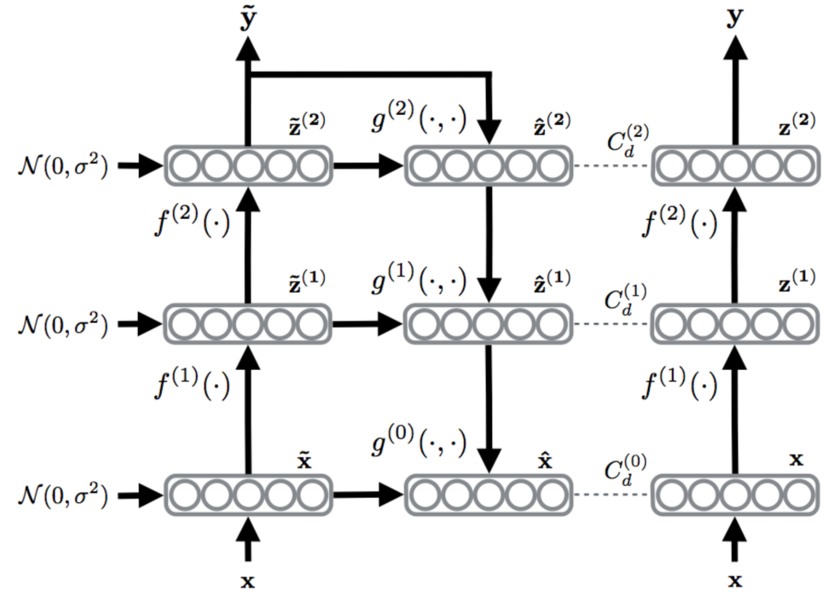

# Semi-supervised_Neural_Network
A semi-supervised neural network which is based on the paper **Semi-Supervised Learning with Ladder Networks** by Pytorch.
The sturctrue of this deep neural network combines supervised learning with unsupervised learning, and it is trained to simultaneously minimize the sum of supervised and unsupervised cost functions by backpropagation.In fact, the unsupervised learing complement supervised learing mission to get a better result.

The structure of this model:



### The result in MNIST of just use 100 labelled data and 49900 unlabelled data

Accuracy: 98.75%

The parameter:
```shell
* Batch size: 100
* Learning rate: 0.02
* Aim epochs: 100
* Random seed: 42
* Noise std 0.3
* CUDA: True
* Unsupervised cost lambda: [0.5, 0.5, 0.5, 0.5, 0.5, 50.0, 20000.0]
* Encoder size: [1000, 800, 600, 400, 200, 10]
* encoder_train_bn_scaling: [True, True, True, True, True, True]
```

### Run and change labelled data
```shell
python3 ladder.py #run
python3 utils/mnist_data.py --num_labelled 100 #change labelled data
```

### About GPU
If your Pytorch can get GPU, this model will firstly use GPU, or use the CPU.
```python
torch.cuda.is_available() 
```
